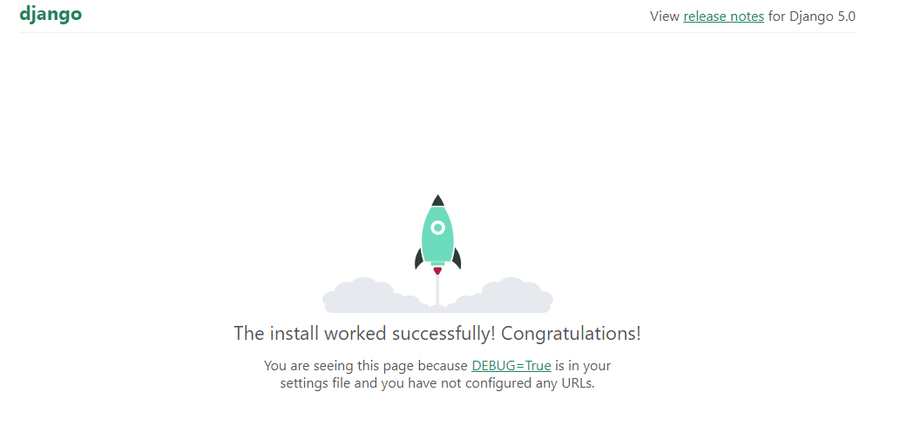

# Python y Django

## Crear proyecto

Creamos una carpeta, abrimos una terminal en la carpeta y colocamos estos dos comandos:

```bash
$ pip install virtualenv
```

```bash
$ virtualenv env
```

Virtualenv es una herramienta usada para crear un entorno Python aislado.

## Activar entorono aislado

En la carpeta que se creamos llamada "env" se crea otra carpeta "Scripts", hay dos maneras de activar el entorno:

1- Abrimos una terminal en la carpeta "Scripts", en la terminal escribioms "activate" y damos enter.
2- Si no reconoce el comando vamos a la carpeta SCripts, veremos que existe un archivo "activate.bat"
le hacemos doble click izquierdo, se abre una terminal y se cierra en cuestión de segundos, ya tenemos el ambiente activado.

## crear archivo de instalación

Creamos en la carpeta raíz un archivo txt que nos permitirá instalar con el nombre requeriments.
Para saber que versión de Django tenemos que instalar buscamos en el sitio web PyPI, entonces buscamos en internet Django pypi y nos aparecerá el sitio, en este ejemplo usaremos la versión 5.0.6, entonces escribiemos en el requeriments.txt la siguiente linea:

`requeriments.txt`

django===5.0.6

en la carpeta raiz vamos a abrir nuevamente la terminal y vamos a crear una aplicacion llamada core, usando el siguiente comando

```bash
$ django-admin startproject core .
```

creará una carpeta core y un archivo "manage.py", ahora en la terminal colocaremos este comando para correr el proyecto

```bash
$ python manage.py runserver
```

al correr django por primera vez en la carpeta env se crea un archivo "db.sqlite3", esta es la base de datos de nuestra aplicación, en la linea 54 del archivo "settings.py" que se encuentra en la carpeta core podemos ver la especificación con la que se creó esa base de datos.
En la consola nos aparecerán algunos textos, en rojo uno que nos indica que faltan hacer migraciones y debajo debajo de la fecha y de la version de Django nos aparece el localhost:
Starting development server at http://127.0.0.1:8000/
podemos colocar esta direccion en un buscador y ver la parte interactiva y visual de nuestra nuestra aplicacion


